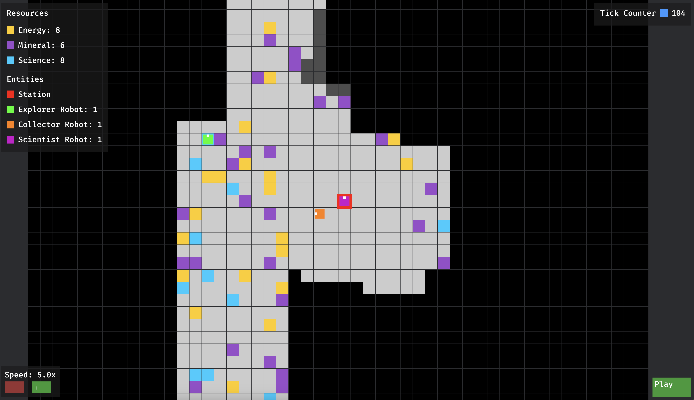

# ProjetEssaim - Simulation de Robots en Essaim


*Capture d'écran de la simulation montrant les robots en action, la station centrale, et les différentes ressources sur la carte*


## Changelog

Pour suivre l'évolution du projet et les changements apportés, consultez le [CHANGELOG](docs/CHANGELOG.md).

## Démonstration

[Vidéo de démonstration](docs/video.mp4)

*Note: Une copie de la vidéo de démonstration est disponible dans le dossier `docs/`.*

## Description

ProjetEssaim est une simulation de robots en essaim développée en Rust. Le projet modélise un système où différents types de robots (explorateurs, collecteurs, scientifiques) travaillent ensemble pour explorer une carte, collecter des ressources et les ramener à une station centrale.

La simulation utilise le moteur graphique Bevy pour offrir une visualisation interactive et en temps réel du comportement des robots.

## Fonctionnalités

- 🤖 **Robots spécialisés** : Explorateurs, Collecteurs et Scientifiques, chacun avec des comportements et des objectifs différents
- 🗺️ **Génération procédurale** de cartes avec différents types de ressources et d'obstacles
- 🔍 **Exploration collaborative** avec partage d'informations entre robots
- 📊 **Interface graphique** avec contrôles interactifs et visualisations claires
- ⚙️ **Simulation paramétrable** avec brouillard de guerre, vitesse ajustable et contrôles de pause/reprise

## Configuration et Création des Robots

### Configuration de la Simulation

Le fichier `src/config/mod.rs` contient les paramètres principaux de la simulation :

```rust
pub const MAP_WIDTH: usize = 50;    // Largeur de la carte
pub const MAP_HEIGHT: usize = 50;   // Hauteur de la carte
pub const SEED: u64 = 42;           // Graine pour la génération aléatoire
pub const FOG_OF_WAR: bool = true;  // Activation du brouillard de guerre

// Coûts de création des robots
pub const EXPLORER_COST: usize = 10;   // Coût en énergie pour créer un explorateur
pub const COLLECTOR_COST: usize = 10;  // Coût en minéraux pour créer un collecteur
pub const SCIENTIST_COST: usize = 10;  // Coût en science pour créer un scientifique
```

### Types de Robots et leurs Rôles

1. **Explorateurs**
   - Coût : 10 unités d'énergie
   - Rôle : Exploration de la carte et découverte de nouvelles zones
   - Comportement : Se déplace de manière aléatoire pour découvrir de nouvelles zones

2. **Collecteurs**
   - Coût : 10 unités de minéraux
   - Rôle : Collecte des ressources (minéraux et énergie)
   - Comportement : Se dirige vers les ressources connues et les ramène à la station

3. **Scientifiques**
   - Coût : 10 unités de science
   - Rôle : Analyse des zones et amélioration de l'efficacité
   - Comportement : Analyse les zones découvertes pour optimiser les stratégies

### Création des Robots

Les robots sont créés à la station centrale. Chaque type de robot nécessite des ressources spécifiques :

```rust
// Exemple de création de robots
let mut robots = vec![
    Robot::new(5, 3, Direction::East, RobotRole::Explorer),
    Robot::new(1, 3, Direction::East, RobotRole::Scientist),
    Robot::new(1, 1, Direction::East, RobotRole::Collector),
];
```

La station gère la création des robots en vérifiant les ressources disponibles et en déduisant le coût approprié.

## Contrôles de la simulation

- **Pause/Reprise** : Bouton dans le coin inférieur droit
- **Vitesse** : Boutons + et - dans le coin inférieur gauche, ou touches du clavier + et -
- **Caméra** : Clic gauche + déplacement pour se déplacer, molette de la souris pour zoomer/dézoomer

## Installation

### Prérequis

- Rust et Cargo (version récente)
- Dépendances de Bevy ([voir la documentation officielle](https://bevyengine.org/learn/book/getting-started/setup/))

### Compilation et exécution

1. Cloner le dépôt
   ```bash
   git clone https://github.com/username/ProjetEssaim.git
   cd ProjetEssaim
   ```

2. Lancer la simulation graphique
   ```bash
   cargo run --bin gui
   ```

3. Ou lancer la version console
   ```bash
   cargo run --bin main
   ```

4. Ou run les test
   ```bash
   cargo test
   ```

## Architecture

- **robot/** : Définition des robots et de leurs comportements
- **station/** : Logique de la station centrale
- **map/** : Génération et gestion de la carte
- **resources/** : Ressources pour l'interface graphique et la simulation
- **bin/** : Points d'entrée de l'application
- **config/** : Configuration globale

## Licence

Ce projet est sous licence [MIT](LICENSE).

